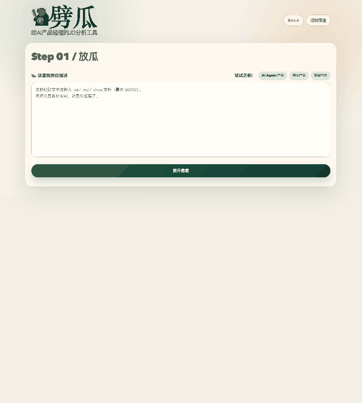
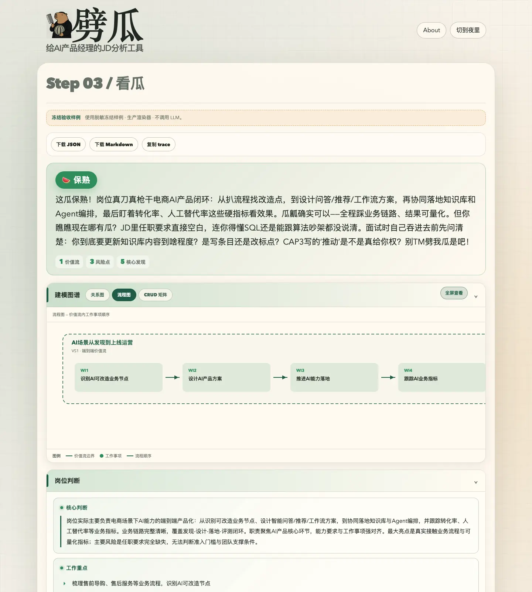

<!--
目的：作为简历二维码访问者的公开项目入口，快速展示劈瓜的产品体验、使用方式和工程边界。
定义：面向招聘方和面试官的个人项目案例页；展示素材均来自脱敏冻结样例。
范围包括：项目定位、产品界面、两种使用方式、个人贡献、可验证工程实现与公开数据边界。
范围不包括：真实 JD、简历、评测原始数据、运行日志、内部设计和密钥。
使用与修改规则：展示素材只可来自已审阅的冻结 fixture；保持 `make ci`、安装命令和公开边界说明与代码同步。
-->

# 劈瓜｜把 AI PM JD 从“关键词堆”劈成可判断的岗位模型

> **个人全链路主导的 AI 产品经理项目。** 把一份 JD 拆成业务链路、职责边界、岗位风险与面试核验问题。

它不是简历匹配或投递建议工具；它先回答更基础的问题：**这份岗位实际在做什么 AI，候选人该追问什么。**

[](https://github.com/chanthomas20180908-cpu/pigua-aipm-jd-analyzer/actions/workflows/ci.yml)

## 这不是关键词云，是一张可操作的岗位地图


> 脱敏冻结样例，使用生产渲染器，不调用 LLM；不含真实 JD、简历、trace 或模型原始响应。

## 从放瓜到看瓜



输入一段 JD 后，工作流依次完成业务元素建模、岗位核心判断、风险质检和口语化总结；结果可以导出 JSON / Markdown，并可回到入口继续分析。

## 图谱不止一张



同一份分析结果可在**关系图、流程图、CRUD 矩阵**之间切换：从“岗位写了什么”追到“实际业务链路是什么、产品经理需要做什么、能力和业务实体如何关联”。

## 两种使用方式

### Agent Skill

适合在 Codex 或 Claude Code 中离线拆解 JD。Skill **无需 API Key、无需联网，也不调用本仓库的 Web API**。

```bash
# Codex
cp -R skills/ai-pm-jd-analyzer ~/.codex/skills/

# Claude Code
cp -R skills/ai-pm-jd-analyzer ~/.claude/skills/
```

在新会话中调用：

```text
$ai-pm-jd-analyzer
```

它会输出岗位业务模型、明确事实与谨慎推断、风险判断和面试核验问题；不做简历匹配、投递建议或公司联网调研。

### Web 工具

适合体验图谱、结构化判断与导出。支持粘贴文本或上传 `.txt` / `.md` / `.docx`（最大 500 KB）。

```bash
python3 -m pip install -r requirements.txt
make dev
```

- 打开 `http://127.0.0.1:8000` 使用真实 JD 分析；需要通过本地环境变量自行配置 API Key。
- 打开 `http://127.0.0.1:8000/sample` 查看冻结验收样例；不调用 LLM，也不写浏览器历史。

## 我做了什么

- **定义问题与元模型**：用价值流、工作事项、业务实体、能力与风险组织 JD，而不是堆叠标签。
- **设计分析工作流**：构建“建模分析 → 质量检查 → 口语化总结”的 v4 模块化 LLM 流程。
- **把判断做成可见的产品**：实现 D3 关系图、流程图、CRUD 矩阵、结果导出与本地历史记录。
- **建立可验证闭环**：用冻结前端样例、公开边界检查和离线 Evaluator–Optimizer Loop 保护迭代质量。

## 工程可信度与边界

- FastAPI 提供服务与静态页面；HTML / CSS / 原生 JavaScript + D3.js 完成前端可视化。
- `make ci` 先执行公开边界检查，再运行编译与单元测试；真实输入、密钥、日志和本机路径不能进入 Git 跟踪文件。
- 历史 MVP 的 5-case 回归 run 曾将 `element_modeling` 最佳 score 从 **0.9333** 提升到 **0.9500**，无 timeout 或执行失败。

<details>
<summary><strong>查看验证口径与公开边界</strong></summary>

- 该历史结果来自旧私有原型的历史回归摘要，未包含 capability 集，不能视为模型准确率、用户效果或商业指标；完整限定见[脱敏验证摘要](HISTORICAL_MVP_VALIDATION.md)。
- 公开仓库不包含真实 JD、简历、评测原始数据、运行日志、内部文档或密钥。协作和安全规则见 [AGENTS.md](AGENTS.md)。

</details>
