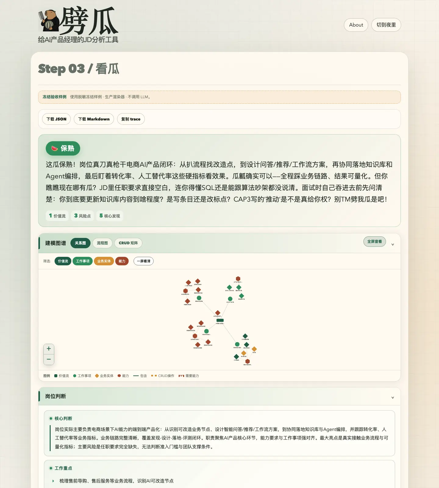
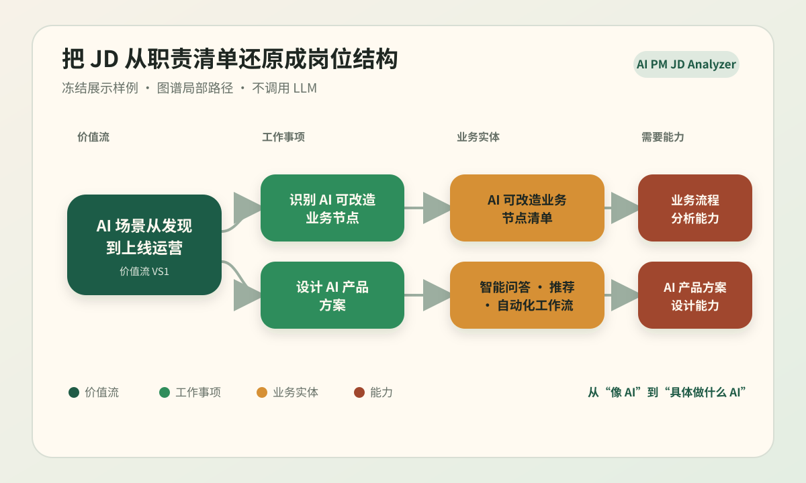
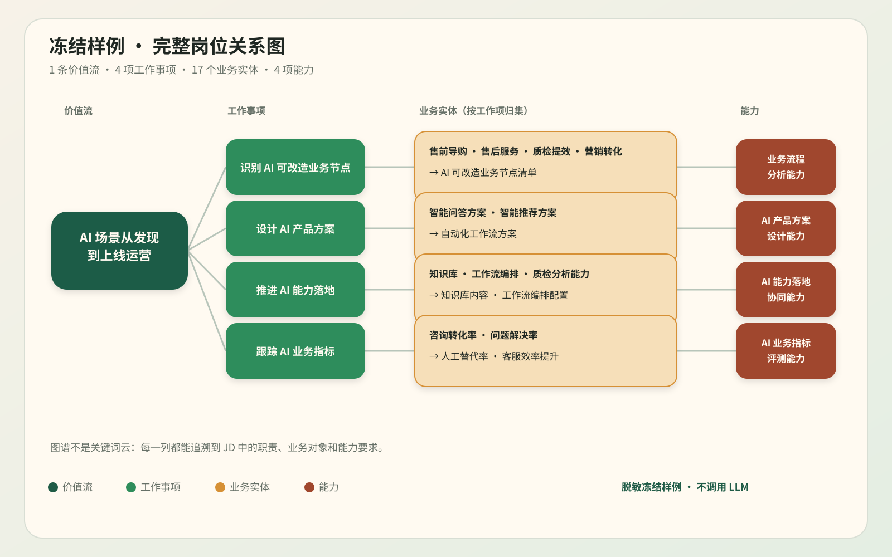

<!--
目的：作为简历二维码访问者的公开项目入口，快速展示劈瓜的产品体验、图谱能力、使用方式和工程边界。
定义：面向招聘方和面试官的个人项目案例页；展示素材均来自脱敏冻结样例。
范围包括：项目定位、产品界面、图谱展示、两种使用方式、个人贡献、可验证工程实现与公开数据边界。
范围不包括：真实 JD、简历、评测原始数据、运行日志、内部设计和密钥。
使用与修改规则：展示素材只可来自已审阅的冻结 fixture；保持 `make ci`、安装命令和公开边界说明与代码同步。
-->

# 劈瓜｜把 AI PM JD 从“关键词堆”劈成可判断的岗位模型

> **个人全链路主导的 AI 产品经理项目。** 把一份 JD 拆成业务链路、职责边界、岗位风险与面试核验问题。

它不是简历匹配或投递建议工具；它先回答更基础的问题：**这份岗位实际在做什么 AI，候选人该追问什么。**

[](https://github.com/chanthomas20180908-cpu/pigua-aipm-jd-analyzer/actions/workflows/ci.yml)


## 这不是关键词云，是一张可操作的岗位地图



> 脱敏冻结样例，使用生产渲染器，不调用 LLM；不含真实 JD、简历、trace 或模型原始响应。

## 先看它怎么理解一份 JD

**图谱局部路径**：从一个业务目标，顺着工作事项、业务实体和能力要求往下拆。



**完整关系图**：同一脱敏冻结样例中，1 条价值流、4 项工作事项、17 个业务实体和 4 项能力如何关联。



> 脱敏冻结样例，不调用 LLM。图谱来自仓库内已审阅的前端验收 fixture；不含真实 JD、简历或模型原始响应。

## 它解决什么问题

招聘 JD 常把业务目标、协作动作、技术名词和任职要求混在一起。只做关键词匹配，容易把“会写 AI”误判成“在做 AI 产品”。

劈瓜把 JD 还原为可讨论的岗位结构：

- **业务链路**：公司想在哪个场景创造什么价值；
- **工作事项与实体**：产品经理需要推动什么、操作什么业务对象；
- **岗位判断**：AI 含量、权责边界、协作复杂度、交付节奏、数据要求和隐性风险；
- **面试抓手**：把模糊的招聘话术转成可核验的问题。

## 我做了什么

- **定义问题与元模型**：用价值流、工作事项、业务实体、能力与风险组织 JD，而不是堆叠标签。
- **设计分析工作流**：构建“建模分析 → 质量检查 → 口语化总结”的 v4 模块化 LLM 流程。
- **把判断做成可见的产品**：实现 D3 关系图、流程图、CRUD 矩阵、结果导出与本地历史记录。
- **建立可验证闭环**：用冻结前端样例、公开边界检查和离线 Evaluator–Optimizer Loop 保护迭代质量。

## English quick start

The Skill package lives in `skills/ai-pm-jd-analyzer/`. It runs locally, needs no API key, does not browse the web, and does not call this repository's Web API.

```bash
# Codex
cp -R skills/ai-pm-jd-analyzer ~/.codex/skills/

# Claude Code
cp -R skills/ai-pm-jd-analyzer ~/.claude/skills/
```

Start a new session and use a prompt such as:

```text
Use $ai-pm-jd-analyzer to analyze the following job description. Write the report in English:

[paste the job description]
```

The default workflow saves `report.md` and `report.html` under `.agents/ai-pm-jd-reports/` in the current working directory. Use a private local working directory for real job descriptions; do not run it from a company repository, synced folder, or other managed location.

The Chinese documentation and full project details continue below.

## 工程实现与验证边界

- **双轨评测机制**：离线 Evaluator–Optimizer Loop 支持将回归集与能力集分开评估，并用回归保护避免能力爬坡掩盖退化；公开仓库不包含私有评测数据。
- **产品化链路**：提供 FastAPI 服务、JSON / Markdown 结果导出、`.txt` / `.md` / `.docx` 输入、本地 `make ci` 与冻结的 `/sample` 前端验收样例。
- **历史 MVP 回归实验**：旧私有原型的 5-case 回归 run 将 `element_modeling` 最佳 score 从 **0.9333 提升到 0.9500**，且无 timeout 或执行失败。
- `make ci` 先执行公开边界检查，再运行编译与单元测试；真实输入、密钥、日志和本机路径不能进入 Git 跟踪文件。

上述历史实验不是模型准确率、线上用户效果或商业指标，也不代表当前公开提交可复现相同分数；完整限定见[脱敏验证摘要](HISTORICAL_MVP_VALIDATION.md)。

## 两种使用方式

### Agent Skill

适合在 Codex 或 Claude Code 中离线拆解 JD。Skill **无需 API Key、无需联网，也不调用本仓库的 Web API**。

```bash
# Codex
cp -R skills/ai-pm-jd-analyzer ~/.codex/skills/

# Claude Code
cp -R skills/ai-pm-jd-analyzer ~/.claude/skills/
```

在新会话中调用：

```text
$ai-pm-jd-analyzer
```

### SkillMD 单文件分发版

SkillMD 的下载包只支持单个 `SKILL.md`，不能携带本 Skill 的引用模型和本地渲染工具。用于该渠道的可独立运行版本位于 [distribution/skillmd-ai-pm-jd-analyzer.md](distribution/skillmd-ai-pm-jd-analyzer.md)：它交付紧凑的证据优先 JD 分析，不会创建本地文件；需要完整 JSON 附录、HTML 图谱和本地报告时，请从本仓库安装完整版本。

当前公开渠道、链接和待重试项见 [RELEASES.md](RELEASES.md)。

### 本地 Skill 迭代

需要在新 linked worktree 中用私有 JD 迭代 Skill 时，先初始化被 Git 忽略的本地 loop 骨架：

```bash
python3 skills/ai-pm-jd-analyzer/tools/init_local_skill_loop.py
```

该命令只复制脱敏流程模板、状态和单 case 执行指令；真实 JD、报告、人工评价与 round 记录仍只留在 `.agents/`，不会进入 commit 或远端。

它会输出岗位业务模型、明确事实与谨慎推断、风险判断和面试核验问题；不做简历匹配、投递建议或公司联网调研。

#### Skill 能做什么

- 将 JD 拆解为价值流、工作事项、业务实体、能力与角色责任。
- 区分明确事实、谨慎推断和未披露信息，避免根据职位名称臆测完整 AI 生命周期。
- 识别伪 AI、职责失衡、责任甩锅和关键边界缺失等风险。
- 用户明确指定输出路径时，生成不依赖网络的完整元模型图谱报告。

### Web 工具

仓库同时包含 FastAPI + D3.js 的产品化探索，适合体验图谱、结构化判断与导出。支持粘贴文本或上传 `.txt` / `.md` / `.docx`（最大 500 KB）。

```bash
python3 -m pip install -r requirements.txt
make dev
```

- 打开 `http://127.0.0.1:8000` 使用真实 JD 分析；需要通过本地环境变量自行配置 API Key。
- 打开 `http://127.0.0.1:8000/sample` 查看冻结验收样例；不调用 LLM，也不写浏览器历史。

## 公开仓库边界

- [AGENTS.md](AGENTS.md) 是公开仓库的协作、分支、PR、worktree 与私有材料边界规则；[CLAUDE.md](CLAUDE.md) 提供 Claude Code 的最小执行入口。
- 本仓库是唯一日常代码仓库，只配置一个公开 `origin`；历史私有仓库只作归档，禁止作为新功能开发或新增远端。
- 不包含运行日志、真实 JD / 简历、评测原始数据、内部文档或 Agent 上下文；API Key 仅通过本地环境变量注入。

<details>
<summary><strong>查看验证口径与公开边界</strong></summary>

- 该历史结果未包含 capability 集，不能视为双轨 combined score。
- 公开仓库不包含真实 JD、简历、评测原始数据、运行日志、内部文档或密钥。协作和安全规则见 [AGENTS.md](AGENTS.md)。

</details>
